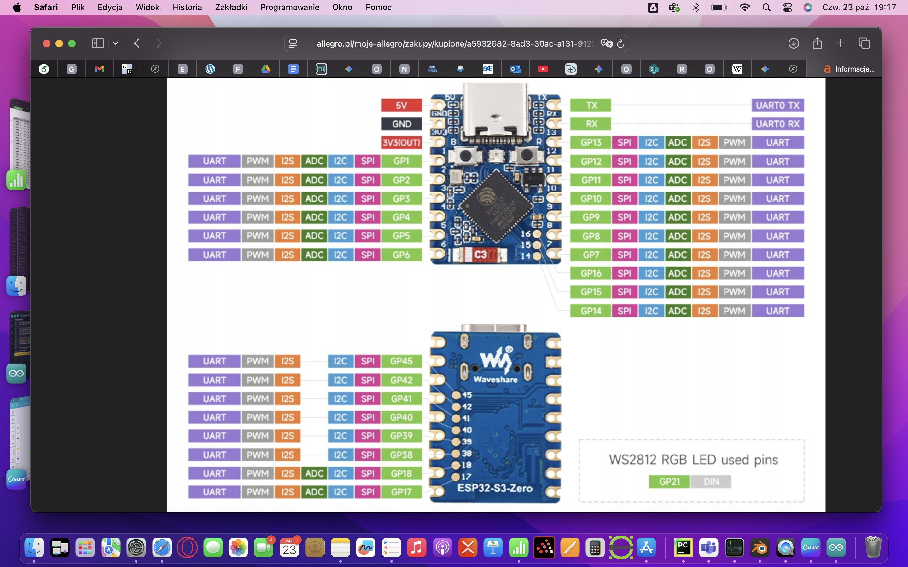

# OnBoardComputer

To jest miejsce przechowania kodu komputera pokładowego rakiety wwodnej
Zrobiłem komputer na ESP32 z MPU6050 i BMP280. MPU się nie sprawdza bo dryft ale barometr działał przy pierwszysch testach dobrze. Teraz zrobiłem poprawki z uśrednianiem
Brakuje w tym serwa według czata nalezy je dac na gp5,6,7 w sensie kabel sygnałowy

