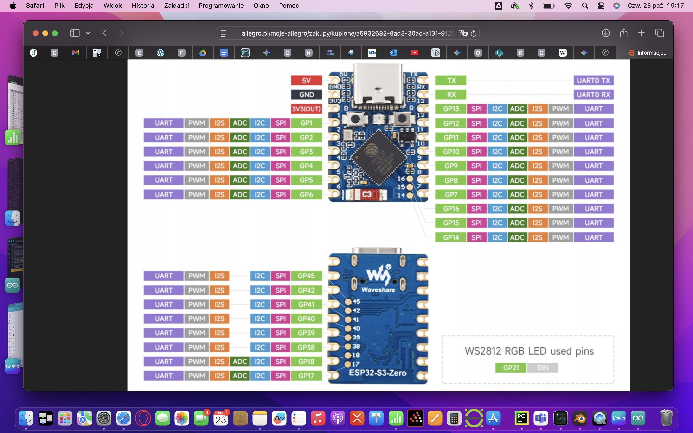

# OnBoardComputer

To jest miejsce przechowania kodu komputera pokładowego rakiety wodnej
Zrobiłem komputer na ESP32 z MPU6050 i BMP280. 
Poniżej widok pinów mojgo esp32

W wersji zapisanej całość działa po połączeniu z dowolnym telefonem po wifi. Sieć jest bez hasła bo w polu w trakcie lotów  i tak nie potrzebujemy
